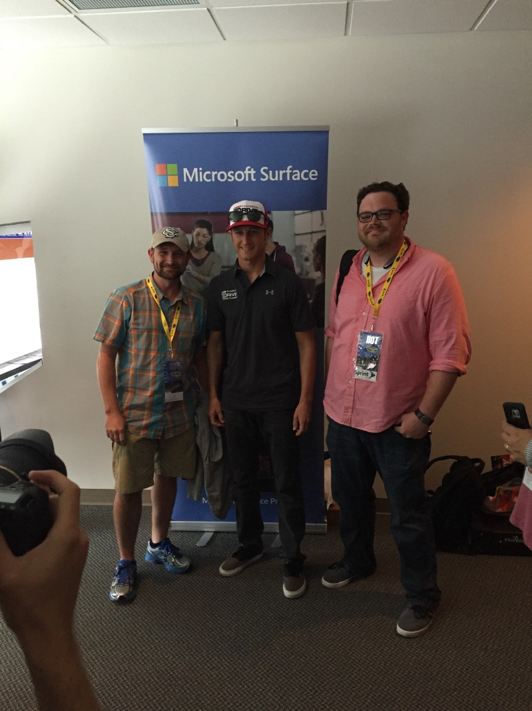

I have been quiet on here recently. There are two major reasons why, which I’ll get to here momentarily — but the tl;dr is that the majority of any new production is happening on GitHub, which you can find here: [https://github.com/jpda](https://github.com/jpda)

This blog has always been a ‘here’s something that was broken, or novel, or interesting, and here’s one way (of many) to fix it.’ Since then, GitHub has become so ubiquitous (and I’ve finally figured out how to use Git well enough to not hurl my computer out the window) that it just makes more sense for that kind of content to live there.

At Bristol (Baby?), August 2016 with our favorite customer, NASCAR

I’ve also taken a new job, in February of 2016 — at Microsoft, no less, helping customers figure out how Azure and cloud can help them get where they need to be. It is _incredibly_ fulfilling and staying close to customers means there’s always something new around every corner.

It does raise difficulties, however, with figuring out a voice and, in particular, what can and can’t be said. The [velocity of change happening in Azure](https://azure.microsoft.com/en-us/roadmap/?v=17.23h) is tremendous and between the minefield of ‘this is private and this is public’ and ‘this is work for a customer who may not want any info public’ has just become a lot to keep track of, and erring on the side of caution is a reliable, albeit unexciting option.

I’m sure I’ll figure out a balance over time, but until then, you’ll find me [here](https://github.com/jpda).