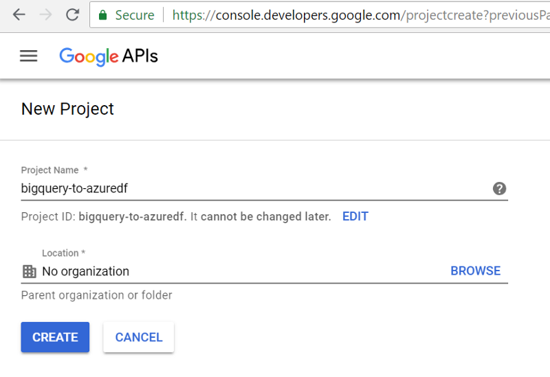
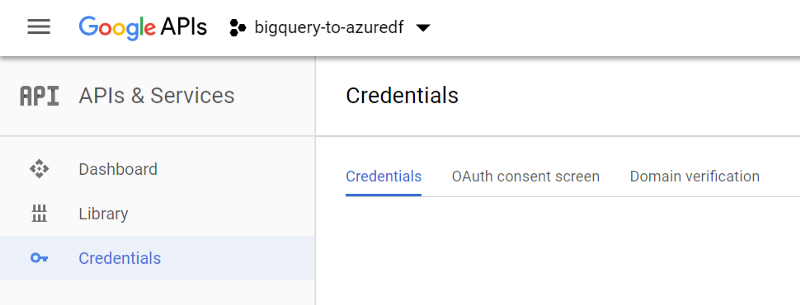
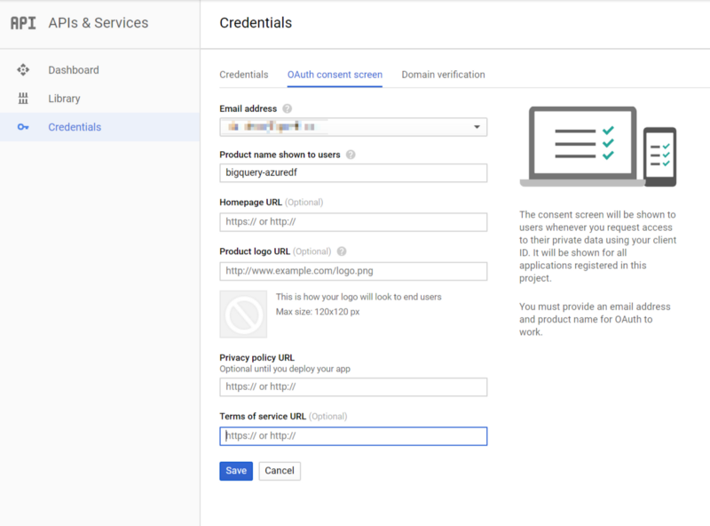
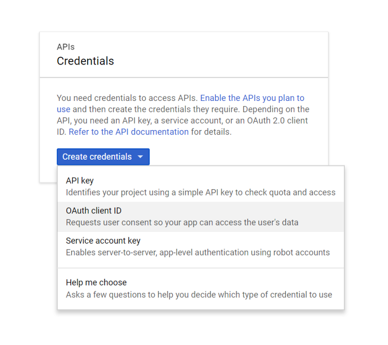
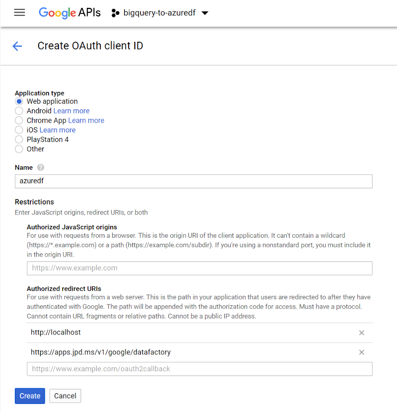
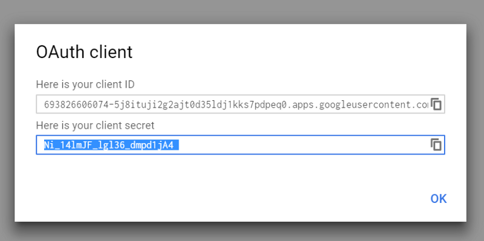
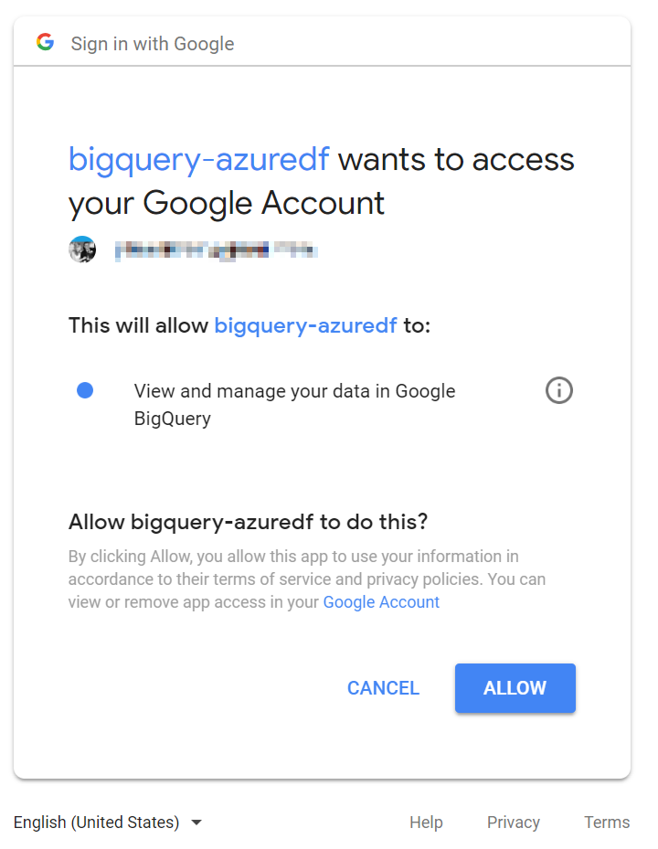
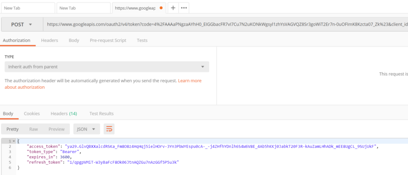

Over here at WTF HQ, I’ve now had a couple data scientist friends ask about getting this wired up — so let’s dig in.

If you’re moving BigQuery data with Azure Data Factory, [start here](https://docs.microsoft.com/en-us/azure/data-factory/connector-google-bigquery), at our official docs for getting ready to connect to BigQuery. When you reach the point about getting refresh tokens, come on back and we’ll get you sorted.

### First, let’s head to Google’s dev portal

If you don’t have an existing application defined in Google’s portal, head [here](https://console.developers.google.com/projectcreate) and create a new project. Probably a good idea to create a new one anyway, even if you already have one, since we want all of this to be independent of other work we may be doing.

Call it whatever you want.

### Let’s get some credentials

Once you click Create, we’ll be back at the dashboard. Make sure your new project is selected in the drop-down next to ‘Google APIs’ in the header. Then we’ll go to Credentials in the sidebar.

First, head to OAuth consent screen. We’ve got a few details to fill in here before we can create our credentials.

About the only detail you really need is a name. This will be shown to users so they know the name of the app they’re consenting to — in our case, since it’s most likely that you’re not actually distributing anything that would use this, I’d make sure it’s something recognizable to you and your organization.

Next we need to generate some credentials for our app to authenticate to Google’s APIs.

We want to create an OAuth Client ID.

Choose web app, give it a name and then drop in a redirect URI. You can use localhost here, but it may be better to use a domain you control. Nothing needs to actually _exist_ at the address, but it does offer slightly less risk, since if your client ID/secret were ever compromised, people could request tokens to be sent back to localhost, which may not be _your_ localhost.

Once you click Create, you’ll be given your client ID and secret. Stash these somewhere you can get back to them quickly, we’ll need them for the next steps.

Yes, I’ve already revoked this app

### Generating Tokens

Next we get into the fun bits. You can use a tool like Postman for this (since we will have one POST request) or you can kick it with curl or your favorite tool. If you’re into artisan, free-range, hand-crafted OAuth URIs you’ve hit the right spot.

First, we need to get user consent to access a specific account (yours, in this case, or wherever your BigQuery data resides). This is a one-time operation, once we have consent we won’t need to do this again.

We need to:

* Generate a URL requesting consent
* GET that URL
* Grant consent
* Take the `authorization_code`that comes back from that GET and swap it out for an `access_token` we can use for actually accessing the BigQuery API.
* And, as a bonus, we need to get a `refresh_token` which is what Data Factory will use to request subsequent `access_token`s

### Generating your consent URL

Gather all the bits we’ve created so far. We need your client ID and secret and a valid redirect URI you put in your OAuth consent details screen.

Here’s our template

`GET https://accounts.google.com/o/oauth2/v2/auth?client_id=**<CLIENT_ID>**&redirect_uri=**<URL-ENCODED REDIRECT URI>**&response_type=**code**&access_type=**offline**&prompt=**consent**&scope=**<URL-ENCODED SCOPE>**`

We’ll deconstruct that a bit:

* `client_id`— your client ID
* `redirect_uri`— the redirect URI you entered earlier. It’s a good idea to encode the URI. If you search Bing for URL encoder you’ll get one right at the top
* `response_type` — `code` is what tells Google we want an authorization code to get returned in the response, which we can use to ask for an `access_token`
* `access_type` — `offline` is what we need to ask for if we need a `refresh_token`(you’ll want this)
* `scope` — this is the target service we want to connect to (in our case, BigQuery). You can check out all available scopes [here](https://developers.google.com/identity/protocols/googlescopes). You’ll most likely want `https://www.googleapis.com/auth/bigquery`

When we’ve plunked everything in there, we should end up with a URL like this:

`GET https://accounts.google.com/o/oauth2/v2/auth?client_id=693826606074-5j8ituji2g2ajt0d35ldj1kks7pdpeq0.apps.googleusercontent.com&redirect_uri=http%3A%2F%2Flocalhost&response_type=code&access_type=offline&prompt=consent&scope=https%3A%2F%2Fwww.googleapis.com%2Fauth%2Fbigquery`

You’ll be asked to sign in, which you should do. Then we’ll get this:

This is our actual consent screen — you’ll notice we’re being asked to allow our app (bigquery-azuredf) to ‘View and manage your data in Google BigQuery.’ Sounds like what we want. Click Allow and keep an eye on your address bar.

Since I used `http://localhost` for my `redirect_uri`, but have nothing hosted at localhost, I just end up with a 404, which is fine. Note the only querystring parameter, `code` — this contains our authorization code, which we’ll use to get our access and refresh tokens. Copy out that value (in this case, starting with 4/AAC…) and stash it somewhere safe for the moment.

### Swap your authorization\_code for some tokens

Now we need to send that code _back_ to Google in exchange for an access token.

We’re going to build another URL and send in some data.

`POST https://www.googleapis.com/oauth2/v4/token?code=**<CODE RETURNED IN PREVIOUS REQUEST>**&client_id=**<YOUR CLIENT ID>**&client_secret=**<YOUR CLIENT SECRET>**&redirect_uri=**<URL-ENCODED REDIRECT URI>**&grant_type=**authorization_code**`

Let’s deconstruct this one too:

* code — the code we got in the last response, which you should have copied off
* Client ID — same one as before
* Client Secret — the one generated when you created credentials earlier. We’re using this for the first time here — we need to authenticate our _application_ to Google for this request to use the authorization code, so we use the ID and secret to do that.
* Redirect URI — same as before
* Grant type — keep this at the string `authorization_code`, per the spec

Now for this we can’t do a GET in the browser, so crack open your HTTP POST tool of choice — Postman, curl, whatever.

In Postman

If all goes well, you should get back an access token and a refresh token! If it didn’t go well, check the error message. Each authorization code can only be used once, so if you used one and got an error, you’ll need to go back in your browser and re-consent to get another authorization code.

I’ve also noticed the authorization codes have slashes and hashes in them, so it might be a good idea to URL-encode them before adding them to your URL.

### Getting our refresh token

Once you get a successful result, you should get a JSON object in the response:

* `access_token` — this is what you (or, in our case, Data Factory) actually send to the API to make a request
* `token_type`— indicates the usage of the token — in this case, it’s a `Bearer` token, which gets used in the `Authorization` header by Data Factory when it calls the service.
* `expires_in`— the validity of the access token, in seconds. You’ll notice this is only 6 minutes — hence the importance of the next field…
* `refresh_token`— this is what we (Data Factory) will use to request subsequent access tokens whenever they’re needed. If you were writing your own app, you’d save off refresh_token to somewhere secure and use it to re-access data without prompting your users.

If you don’t have a refresh token in your response, make sure your initial request includes `access_type=offline`!

### All done!

At this point we’re all done! Take your `refresh_token`, add it to the BigQuery connector in Data Factory and test your connection.

### Bonus: getting an access token manually from your refresh token

If, for whatever reason, you’d like to get an access token from your refresh token manually, here’s a sample request you can use:

`GET https://www.googleapis.com/oauth2/v4/token?**refresh_token**=<REFRESH TOKEN HERE>&**client_id**=<YOUR CLIENT ID>&**client_secret**=<YOUR CLIENT SECRET>&**redirect_uri**=<URL-ENCODED REDIRECT URI>&**grant_type**=refresh_token`

And its deconstruction:

* `refresh_token` — the refresh token you saved **somewhere secure** since the last request
* `client_id`, `client_secret` and `redirect_uri`— the same ones we’ve been using
* `grant_type` — always the string `refresh_token` (not your actual refresh token)
