We get some strange and interesting requests over here at WTF HQ and today’s is no different. From a colleague:

> One of my clients has web apps in one sub, and would like to have other subs in different region to have also a DR \[site\]. It seems we cannot use TM with diff subscriptions. Is there any other way?

Indeed, the docs say [**this isn’t supported**](https://docs.microsoft.com/en-us/azure/traffic-manager/traffic-manager-faqs#traffic-manager-endpoints). You probably should just stop reading now and go back to what you were doing before, but who can turn down an interesting challenge?

From the [docs](https://docs.microsoft.com/en-us/azure/traffic-manager/traffic-manager-faqs#traffic-manager-endpoints):

> Using endpoints from multiple subscriptions is not possible with Azure Web Apps. Azure Web Apps requires that any custom domain name used with Web Apps is only used within a single subscription. It is not possible to use Web Apps from multiple subscriptions with the same domain name.

There is a lot to unpack in that statement. I’d argue some of that is inaccurate, at least in the current implementation — it’s easy enough to verify and associate the same host name to multiple web apps regardless of subscription (or even AAD tenant!) using the _awverify_ method of validating domains.

But let’s start fresh and try to crack this nut. We’ll need:

*   Two Azure subscriptions of whatever flavor
*   Two Azure App Services (web apps), one in each subscription. Make sure your App Service plans are Shared or higher, for using Custom Domains; Basic or higher if you need TLS/SSL (as you should, it is 2018)
*   a Traffic Manager namespace in either sub
*   A custom domain and access to your DNS for that domain

My resources are named…

*   web app 1 is **test-multi-sub-1.azurewebsites.net**
*   web app 2 is **test-multi-sub-2.azurewebsites.net**
*   Traffic Manager DNS name is **test-multi-sub.trafficmanager.net**
*   Target hostname for users to access the app: **test-multi-sub.eastus3.com**

### First web app

If your first web app and your Traffic Manager instance are in the same subscription, use an Azure Endpoint, as you would normally, and choose the web app in that subscription.

You’ll note only one of our web apps is available for selection, since TM can’t traverse subscription boundaries.

For our second web app in the other subscription, we’ll use an [external endpoint](https://docs.microsoft.com/en-us/azure/traffic-manager/traffic-manager-endpoint-types#external-endpoints); the external endpoint is just that — an FQDN or IP that points to where your web app lives, regardless of whether it’s hosted in Azure, AWS, on-prem, wherever.

Let’s add our second web app as an external endpoint in our traffic manager instance. It’s pretty straightforward — choose external and fill in some fields:

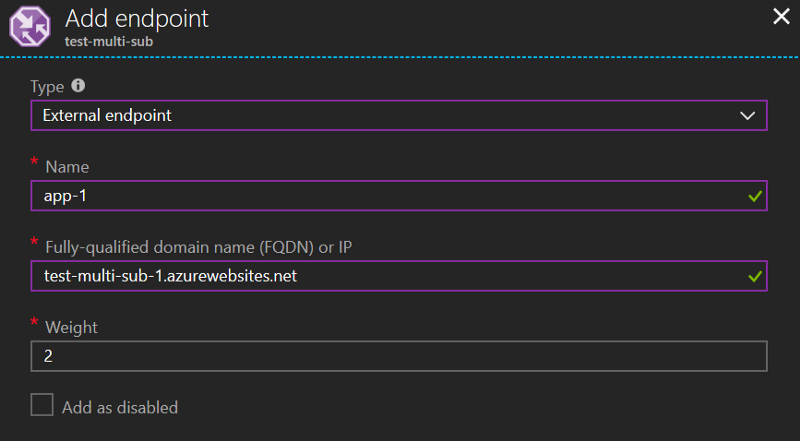
External endpoint, FQDN of our app, done.

### DNS, Custom Hostnames and awverify

Now that we’ve got our two endpoints in Traffic Manager, we can move on to configuring custom hostnames for our individual web apps. This is important, because App Service is driven by host headers. If the same hostname isn’t added to both of your webapps, it won’t respond to requests.

In my example, the ultimate name users will use to connect to my webapp is [http://test-multi-sub.eastus3.com](http://test-multi-sub.eastus3.com) — we need to

*   add `test-multi-sub.eastus3.com` to each web app as a custom hostname
*   add `test-multi-sub.trafficmanager.net` to our external webapp endpoint as a custom hostname
*   In DNS, add a CNAME for `**test-multi-sub.eastus3.com**` that points to `**test-multi-sub.trafficmanager.net**`.
*   e.g., `test-multi-sub IN CNAME test-multi-sub.trafficmanager.net`

This is, again, pretty straightforward, but will be a bit of a shell game. To verify a custom hostname in an Azure Web App, you need to add some DNS records to verify you own the custom host name. There are two ways to do this, we’re going to use the `awverify` method, which lets us verify a domain without actually pointing the domain itself to the App Service. Instead, we create TXT records with some pertinent info.

### Verifying the custom hostname

Get your DNS console open — Azure DNS, Route 53, GoDaddy, whoever — and add a TXT record for your first web app, using this syntax:

*   Hostname —` awverify.targethostname.yourdomain.com` — in my case, `awverify.test-multi-sub.eastus3.com`you probably won’t need to add the full root domain name (e.g., eastus3.com) in your record creation, but that depends on your DNS provider’s interface.
*   Set type = TXT
*   value = <yourwebappname>.azurewebsites.net
*   e.g., `test-multi-sub-1.azurewebsites.net`
*   TTL — short. Like seconds or minutes.

Here’s what that looks like in the Azure DNS console:

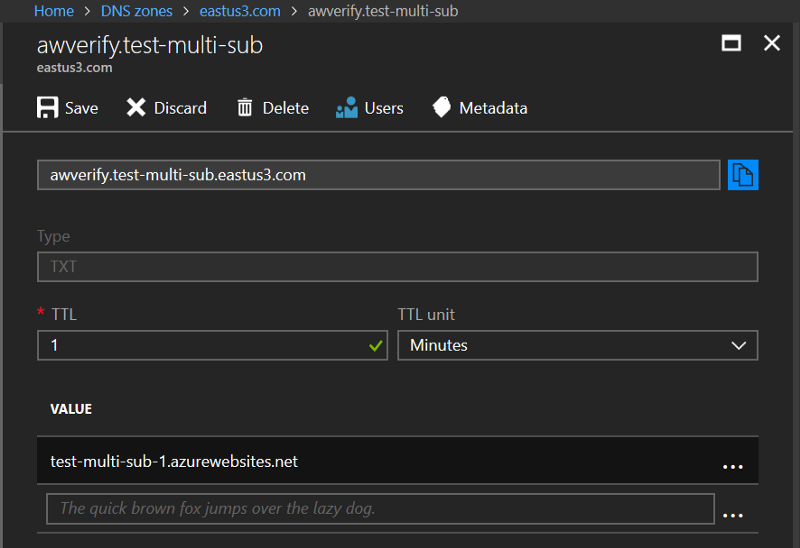
Set a short TTL — we’ll be changing this shortly.

Keep the DNS window open because we’re going to need it again in a minute. Open a new window and we’ll go get our Web App configured with the new hostname.

### Adding the hostname to the webapp

Open your Web App, go to Custom Domains in the nav bar. This is pretty standard, how you would add a custom domain to any web app.

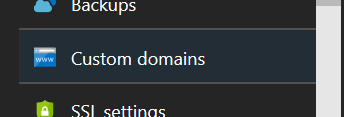

Next we’ll add a hostname

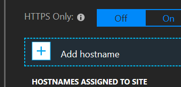

Put in the target hostname users will use to access your app. Remember, we need the web app to respond to requests that come in on that hostname, since that hostname is what we’re going to be using with traffic manager.

Provided the awverify DNS records you put in are correct and have replicated, you should get two nice green checkboxes at the bottom:

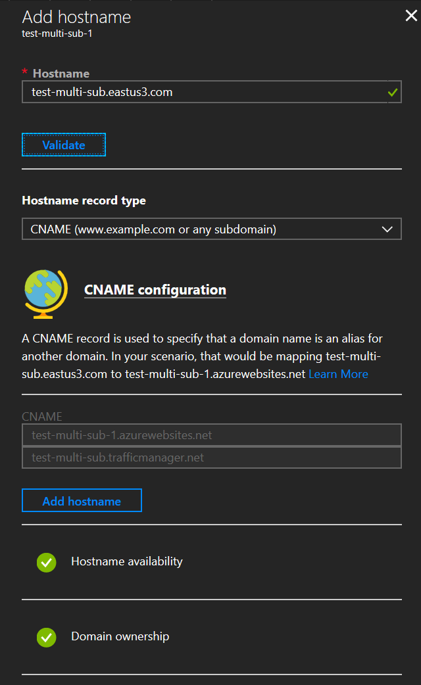
You can ignore the ‘test-multi-sub.trafficmanager.net’ entry in the image below. We’ll get to that in a minute :)

If everything went ok, you can click Add Hostname in the validation pane. Back in the main view you should see your new hostname assignment.

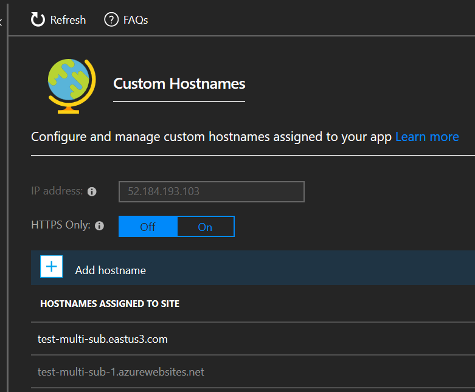
yay

### Reconfiguring DNS and our second webapp

First let’s reconfigure DNS to have our `awverify` record point to our second webapp now. In my case, instead of `test-multi-sub-1.azurewebsites.net`, we’re going to use `test-multi-sub-2.azurewebsites.net`.

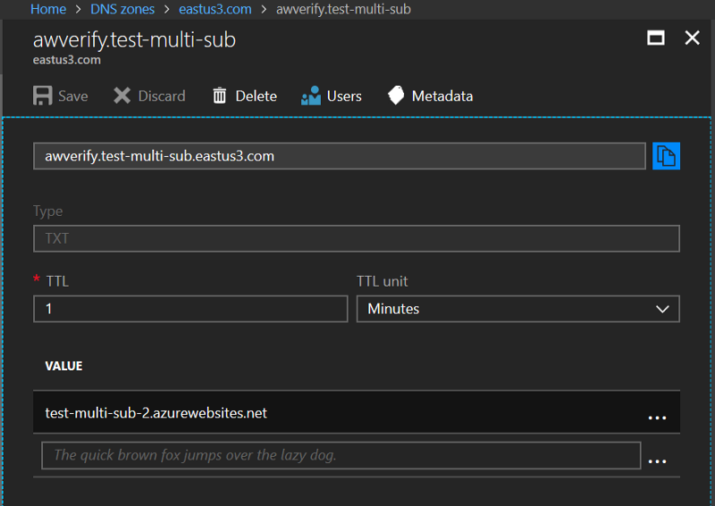
Note the subtle difference — test-multi-sub-2 instead of test-multi-sub-1

Once you’ve saved your DNS record, let’s go to Custom Domains for the second webapp. It will largely be the same process, _however,_ you won’t get visula feedback in the portal as you expect. This is largely because, I assume, this is an unsupported scenario and you really shouldn’t be doing this anyway.

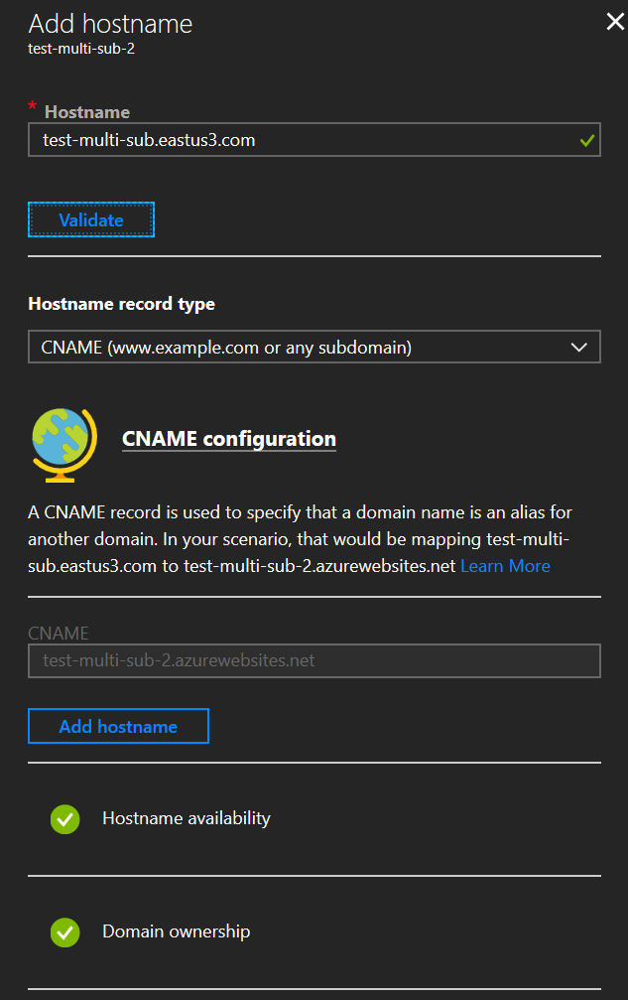
Add the same target domain as the custom hostname here too.

Remember, use the same DNS host name as before — the one your users will use to actually access the app. In my case, `test-multi-sub.eastus3.com`. You’ll notice you get validated green checkboxes again; you’ll get a successful ‘Add hostname’ notification as well.

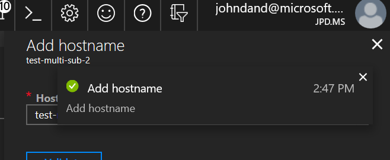

What you won’t see is your hostname in the UI, at least not initially. My only assumption (and you know what [they say about assumptions](https://xkcd.com/1339/)) is that this is failing some validation, but not enough to stave off actually committing the change.

While you’re here, go ahead and add your traffic manager DNS name as a custom hostname as well. The same thing should happen — you’ll get a slew of green checkmarks, but your custom hostnames may not appear. They didn’t for me until a bit later and after a full refresh of the page.

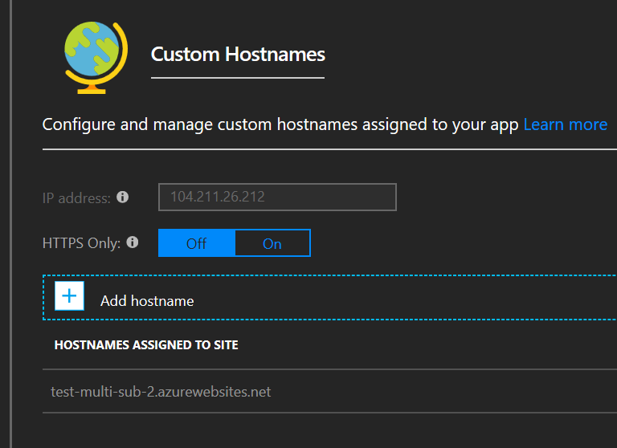
They may not show up, but…

We can validate they’re actually added and available in PowerShell using `Get-AzureRmWebApp -Name web-app-name` or, in CLI, `az webapp show --resource-group <your rg> --name web-app-name`

Powershell, like if C# had a goofy syntax
Web app 2, for reference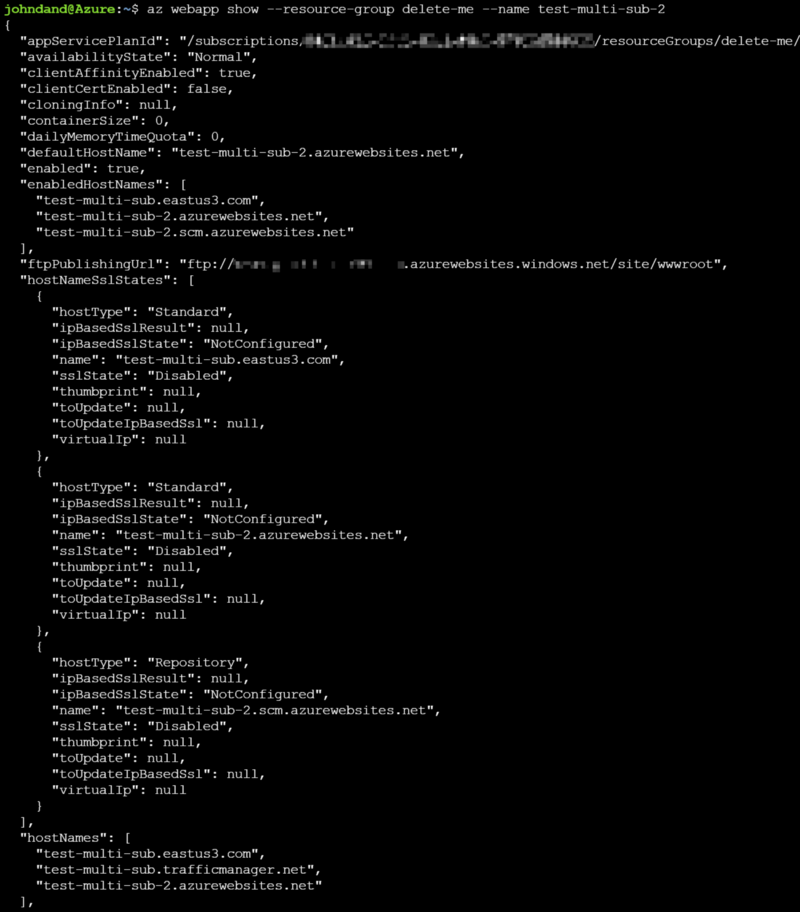
CLI, for when all your friends on twitter make fun of you for using powershell

### Checking it all out

Provided we made it this far, we should be able to navigate to our site via the user custom hostname (http://test-multi-sub.eastus3.com) and get to one of our webapps. At this point, Traffic Manager has the wheel for, well, managing traffic through that hostname.

I have simple webapp deployed to both apps that just has a string of the name of the host
This tab was before an ipconfig /flushdns and a shift-reload on the browser

### We’re done!

Navigate to your site and you should be able to access both of your endpoints via the Traffic Manager name. You may want to play with weights and flushing your DNS resolver cache to see both sites resolve from the same endpoint name.

### We’re done?

Almost. We can see the hostnames are bound to our web app, which is good — this means our webapp instances will respond when traffic is sent to it with that hostname. But it’s also 2018 and we need TLS/SSL.

Head back to the portal and let’s configure TLS/SSL bindings on both of our webapps. If your App Service Plan is Shared or Free, you’ll have to scale up to Basic or higher for SSL.

Go to SSL settings in each web app and we’ll get our certificates uploaded and bound. Now we’re done!

Upload your cert!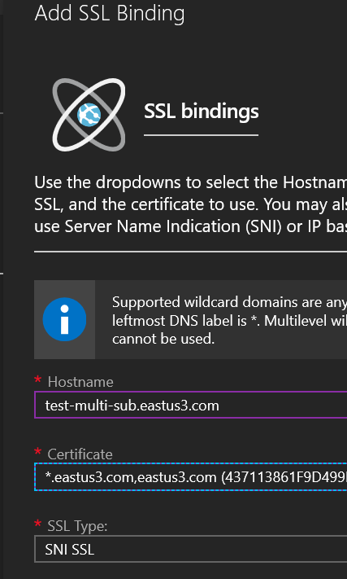
Bind it up to both sites!
yay