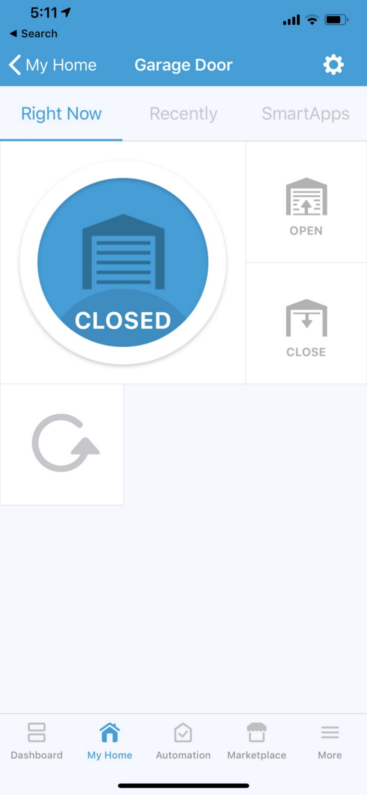
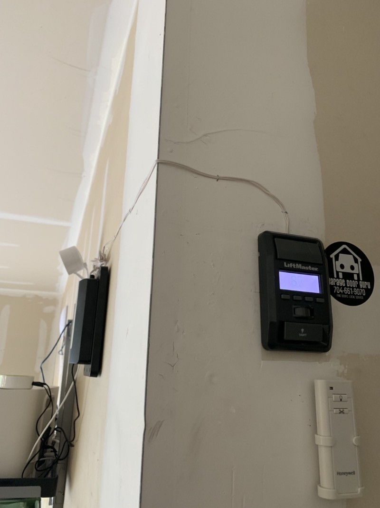

I’ve been on paternity for a bit now so taking time to tackle some home projects. Today’s was a Z-Wave Garage Door remote for SmartThings. The kids are constantly leaving the garage door open so I thought it’d be nice to both be able to see the status and change the status.

I thought this would be a simple fix — buy component, wire in, pair up, done. It wasn’t quite that straightforward but nothing unachievable.

### Z-Wave Component

First we need the Z-Wave component. There only seems to be one produced, rebranded for many different companies — GoControl, NuTone, Iris, Nexia, etc. Lowe’s said they had it in stock so I decided to go pick one up. After wandering around looking for someone to help me, we finally got it. $75 — cheaper than Amazon.

](img/0__1HWQEvExpOg6JN7D.jpg)
[https://www.lowes.com/pd/Iris-Universal-Garage-Door-Internet-Gateway/50213045](https://www.lowes.com/pd/Iris-Universal-Garage-Door-Internet-Gateway/50213045)

You’ll note it says — ‘Requires Iris smart hub’ — this isn’t entirely true, it really only requires a Z-Wave compatible hub. It paired right up with my SmartThings 2015 v2 hub.

### Wiring it into the opener

This was my first roadblock. I’d get the beeps and the lights (intended to warn anyone in the garage the door was about to open/close) and I’d hear the relay click, but the door wouldn’t move. Some digging left me with a document that said the MyQ-enabled or MyQ-ready Chamberlain systems weren’t compatible. Some searching led me to a forum where people were talking about cracking open the Z-Wave box and soldering jumpers between two contacts — definitely a PITA.

Instead, I decided to try mimicking the wall switch, by wiring the Z-Wave box directly into the switch buttons the wall switch presses. I have a LiftMaster 880 wall switch. Take it off the wall and there are two switches (left and right) near the top, directly underneath the large plastic open/close bar. On the contacts for these switches, solder on the downstream/bottom leads of one side (I used the right side). Close it up and you’re ready to go. No changes to the main opener, no cracking open the z-wave box, just wire the leads from the Z-Wave box into the switch in your wall switch.

