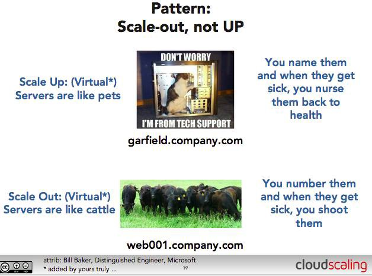
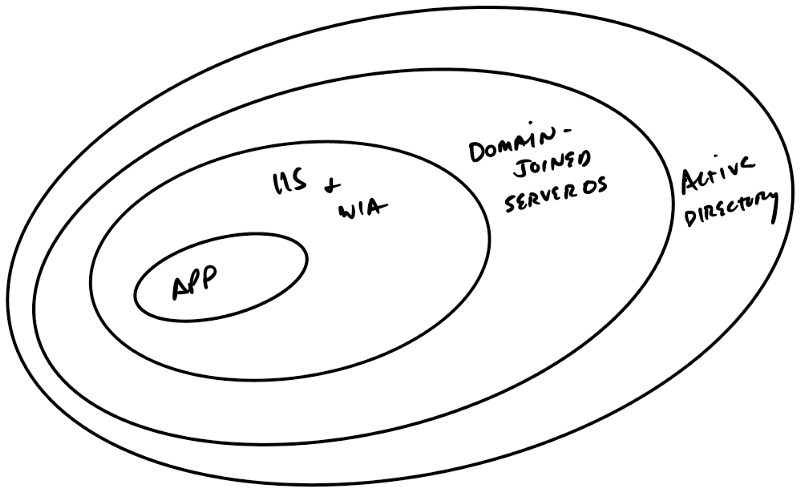

Identity is a fundamental topic when building any software; more so in cloud where we can’t rely on environmental configuration — like a directory service, or being domain-joined, or having Kerberos configured. Combine that with recent strides microservices, and we have a large potential headache. How do we authenticated and authorize services to each other?

This isn’t a new problem — the promise of unlimited scale and rapid, just-in-time provisioning doesn’t suit well to the [‘pets’ mentality of managing servers](http://www.theregister.co.uk/2013/03/18/servers_pets_or_cattle_cern/). Any organization revolutionizing their operations (dare I say ‘transforming’ 🙄) will have this problem — how do I balance management and deployment in a world where all our servers are ephemeral? 

from _The Register, original Bill Baker_

Active Directory (and other directory services) help solve a core issue of identity in organizations, giving us a centralized repository of users, accounts, devices, computers, all sorts of things. This means I have a single central identity that’s used for resources all throughout the organization. The tradeoff to centralized management is heavy dependency on client + server speaking the same protocols and securely exchanging data via a trust. In the AD world, this relies on a workstation trust + a user account — in the context of our software, we can validate the workstation and the user trust via the centralized directory. 

### Exploring our environmental rings

We’ll take a sample app with, say, a SPA front-end, an API for processing requests, a database and a couple of auxiliary downstream services. 

For a traditional Active Directory-based, Windows desktop organization, we can use Kerberos to authenticate services to each other, using service accounts. Users can be authenticated via Kerb and NTLM too. As .net developers we were spoiled with conveniences like`User.Identity` and `User.Identity.IsInRole`. 

Environmental dependencies

That sort of convenience relied on a ring of environmental factors, however — we needed, at a bare minimum:

*   A domain controller
*   A domain-joined Windows server
*   IIS configured for WIA
*   A desktop client that supported WIA (like Windows)
*   A desktop client browser that supported WIA (like IE)

That’s a lot of heavy dependencies, most of which are typically handled by human beings. A lot of places have even more they need to do — installing and managing agents on VMs, supporting infra like WSUS for patching, monitoring systems, all sorts of stuff. Most organizations have a map of processes for adding servers to domains, which can increase both the complexity and duration of those tasks dramatically. This is probably why the mean request-to-app-server-time among customers I visit is around 4 months. 4 months! 

Imagine we wanted to take that app to a public cloud (or \_any\_ non-corp environment) — we could replicate our rings, at great cost and expense and with no added flexibility or we could make our app a bit smarter about its situation. Or imagine we just wanted to be _better_ at ops — start treating our servers like cattle and less like pets. It simply wouldn’t scale to touch every server before it was usable for servicing application requests.

### Getting smarter and collapsing our rings

Identity is such a core fundamental of most applications that enlightening our app with identity awareness has a big return — we can host anywhere and offer our users a customized experience based on who they are. We can keep our own password database, but unless you’re interested in contributing to [Troy Hunt’s public service](https://haveibeenpwned.com/) that’s probably not a good idea. Plus, for corporate users, we certainly don’t want people having a separate username/password from corp -so we’ll definitely want to replicate centralized user and principal management but without taking on all that responsibility ourselves — we’ll use an external identity provider.

For this we’ll be using Azure AD, but there are many external identity providers your app can trust. The mechanism is similar, but the dependency is within the app, as opposed to another environmental trust (like a workstation/server trust with a domain). 

We’ll still need to validate our tokens, but instead of relying on our environment, we’re going to let our app handle it. There are many libraries for handling the plethora of identity-related protocols out there, OAuth, OpenID Connect, etc — typically best to stick with a well-known and supported auth library rather than rolling your own. I tend to use [ADAL](https://docs.microsoft.com/en-us/azure/active-directory/develop/active-directory-authentication-libraries) since most of my work is with Azure and there are packages for most languages, but there are plenty of others for various languages and identity providers.