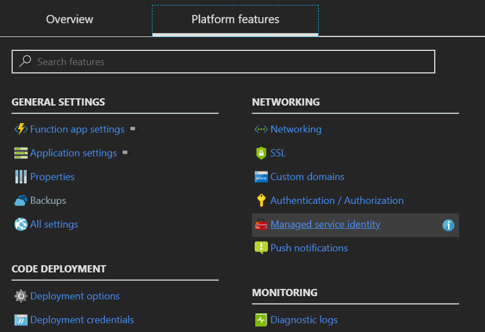

If we want to access protected resources from our apps, we usually have to ship a key and secret in our app. This traditionally meant registering an application/service principal in Azure AD, getting an id + secret, then granting permissions to that principal in things like Key Vault. At runtime, our code would use that ID + secret to authenticate to AAD and get an access token to use to connect to the other service.

Operationally, this is pretty inconvenient — now I have app registrations and secrets that all need to be managed — secret lifecycles in particular. Plus I have to ship those secrets in config or appsettings and go to lengths to secure those secrets in whatever environment I’m running in.

The docs cover a lot of frequent use cases — accessing [Azure Storage](https://docs.microsoft.com/en-us/azure/active-directory/managed-service-identity/tutorial-windows-vm-access-storage-sas), [SQL DB](https://docs.microsoft.com/en-us/azure/active-directory/managed-service-identity/tutorial-windows-vm-access-sql), [Data Lake Store](https://docs.microsoft.com/en-us/azure/active-directory/managed-service-identity/tutorial-windows-vm-access-datalake), [Resource Manager](https://docs.microsoft.com/en-us/azure/active-directory/managed-service-identity/tutorial-windows-vm-access-arm), etc, but don’t address using this with our own apps. As we continue down the path of broad, distributed suites of services that all need to communicate between each other, there’s a huge advantage in having the identity of my apps being managed by the platform instead of relying on writing more automation, alerting or human processes.

I’m using Azure Functions, but this will work in full App Service, as well as Azure VMs and VM Scale Sets. It’s actually pretty simple. Here’s our simple landscape:

*   Function app 1: msi-func, MSI-enabled App Service
*   Function app 2: aad-func, Azure AD registered application

### aad-func

This represents a typical API — just an AAD-protected service. If you use the built-in Authentication/Authorization functionality of App Service for your function, you get the added benefit of App Service validating the `Authorization` header for you.

Add Azure AD via Function App → Platform Features → Authentication/Authorization

Next we’ll go create an `appRole` in our app registration. This is effectively an Application scope we can assign to our MSI. You’ll find the app’s registration in AAD like you would normally, as the ‘Express’ management mode in App Service just automatically creates you an app registration.

Note the `allowedMemberType of Application — this creates a scope assignable to an application`

Now we’ll give our function a little bit of code — nothing too exciting here.

### msi-func

In our MSI function, we want to enable MSI first.

Platform Features → Managed service identity → Turn on

Next we’ll add a bit of code. A bit more than our other one, but still not much.

We’ll need to add a package.json too, to pull in the magic assembly that handles asking the local MSI endpoint for a token:

[Or call the endpoint manually](https://docs.microsoft.com/en-us/azure/app-service/app-service-managed-service-identity#rest-protocol-examples) with `HttpClient` or whatever in your language of choice.

### Adding our MSI to the appRole

Lastly, let’s get our app added to the appRole we created earlier. This is optional, so if you don’t have permissions in your directory, it’s ok to skip.

Crack open Azure AD Powershell v2

We’re ready! Go back to your MSI function and click Run — you should get a set of claims returned in the response. Let’s take a look:

I removed a few for brevity, but here are some important ones:

*   aud(ience): this is our AAD app’s ID, so this token is valid for our app
*   iss(uer): this was issued by our AAD tenant, so we can trust the source
*   appid: this is the ID of the application that requested the token, in our case it matches our MSI’s app ID (not object ID)
*   identityprovider: also our tenant
*   roles: here’s our role — DoAll
*   nameidentifier: the MSI app’s object ID (not app ID)
*   tenantid: our tenant again, just in case

And all without shipping a secret in our code! Try out MSI today.